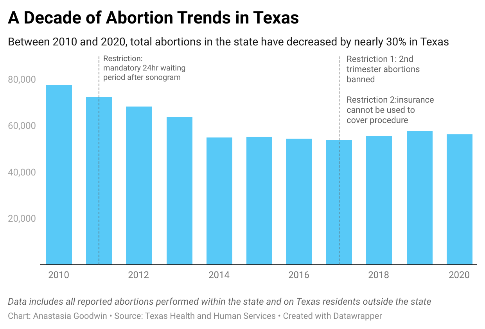
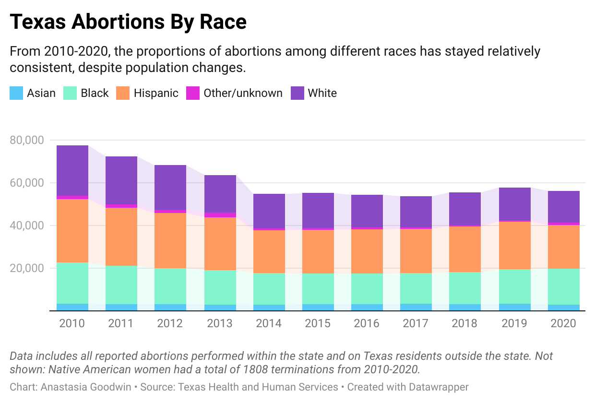
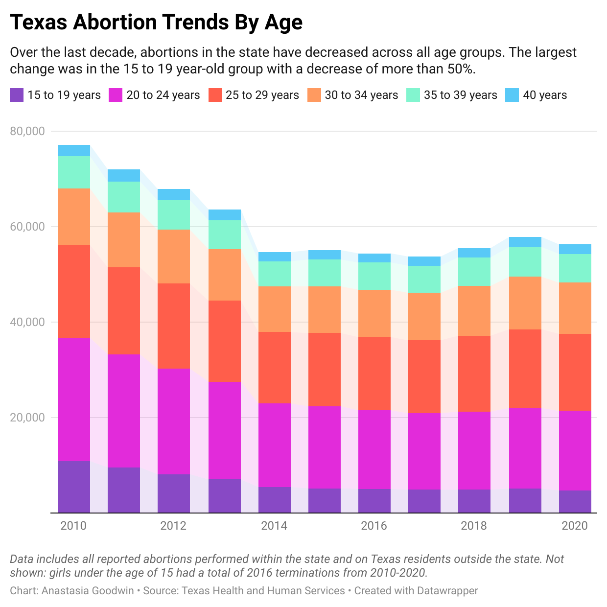

```{r setup, include=FALSE}
library(tufte)
# invalidate cache when the tufte version changes
knitr::opts_chunk$set(cache.extra = packageVersion('tufte'))
options(htmltools.dir.version = FALSE)
```


In September, the Texas six-week ban on abortions went into effect, continuing a ongoing tradition of restrictions passed by state lawmakers to limit abortion access. Advocacy groups say the new law creates more barriers to care, especially among vulnerable populations in Texas, such as Black and Hispanic women who accounted for 66% of the total abortions reported by providers in 2020. 

“Even though SB8 [Senate Bill 8] is the most restrictive anti-abortion bill in the country, we have had a plethora of already pre-existing restrictions against abortion access,” said Nancy Cardenas Pena, the state director for policy and advocacy at the National Latina Institute for Reproductive Justice, a reproductive rights group that works with the Latinx community in Texas.

According to the Induced Terminations of Pregnancy data from the Texas Health and Human Services Commission, which tracks abortions statistics performed in the state and on Texas residents outside of the state, the number of reported abortions has dropped by 28% in the last decade. Abortions for 2020 totaled 56,358 compared to the 77,592 in 2010. With the six-week ban now in place, the number of abortions performed in the state is expected to drop further as Texas women travel to surrounding states for the procedure. 

Data for out of state abortions is provided through a voluntary program called the State And Territorial Exchange Of Vital Events, said Kelli Weldon, a press officer for Texas Health and Human Services. It is unclear how up-to-date or inclusive the data provided is.



Link to chart: https://www.datawrapper.de/_/qtC1k/ 


In 2020, white women accounted for only 26% of reported abortions in the state, even though they represent around 74% of the female population, according to U.S. Census data.  On the other hand, Black women, who only make up about 12.5% of the female population of Texas, accounted for 30% of the terminations in 2020. 

Hispanic women made up a fairly proportionate share of abortions in 2020 —  accounting for 36% of total abortions while representing 39% of the female population. However, when it comes to traveling outside the state, Hispanic women accounted for only 10% of those reported to have been performed on Texas residents outside the state.  

Groups working with Texas immigrant communities note that the six-week ban poses unique challenges to many of the women they work with — especially those who are undocumented. Cardenas Pena, who primarily works in the Rio Grande Valley, said that undocumented women who travel outside the area risk being picked up at internal immigration checkpoints. 

“So you're faced with a very difficult decision, which is being forced to carry a pregnancy to term or finding ways to terminate your pregnancy, regardless of the restrictions, or being put into deportation proceedings because you risked going outside of these areas to attain abortion care,” Cardenas Pena said.



Link to chart: https://datawrapper.dwcdn.net/dJbdO/1/ 

Cristina Parker, the communications director for The Lilith Fund, an abortion fund that helps Texas women to help cover the cost of having an abortion, said the six-week ban is only one of many obstacle to care in the state. Parker said previous restrictions, such as the 2011 legislation requiring wait times, have significantly limited providers’ capacity to serve patients in the state.

“That makes it so that people have to go to two appointments to get an abortion,” Parker said. “So that cuts in half the capacity of clinics to see people.”

Parker said the majority of women they help are from the Houston area. In 2020, Harris County reported 14,000 abortions, the highest number of any county in the state. Travis, Bexar, Dallas, and Tarrant counties also topped the list of highest number of abortions in the state. The counties encompass the state’s most-populace cities, and also have higher concentrations of abortion clinics than more rural areas.

Other demographic groups, such as minors, have also been put in a precarious position due to the new legislation. In 2000, Texas passed restrictions requiring parental consent for abortions performed on underage teens. Teens who wish to bypass this requirement can go through a court process known as “judicial bypass” to get a court order for the procedure. 

HK Gray, a youth advocate for Jane’s Due Process, an abortion fund in Texas that assists teens with the legal process and costs of obtaining an abortion, said the process normally takes around four to six weeks. Gray, who went through the process herself as a teen, said the six-week ban will now make most minors in situations like the one she experienced ineligible for a procedure in the state.

“​​When we're talking about the communities that are most effected by bans like this, it's mostly people who come from low income communities, people that are black and brown, and a lot of undocumented immigrants,” Gray said. 



Link to chart: https://datawrapper.dwcdn.net/bm8XF/2/ 

In 2020, less than 10% of the total abortions reported for the state of Texas were performed on women aged 19 years-old or younger. The vast majority — 77% of  reported abortions — were performed on women ages between 20 and 34 years-old. 

“A lot of times when these laws get put in place, I don't think people realize the overall real effect that it's going to have on the people trying to navigate this new abortion ban,” Gray said. 

